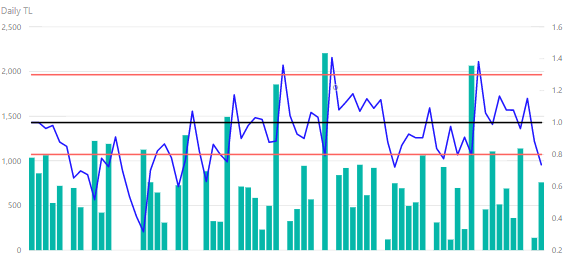
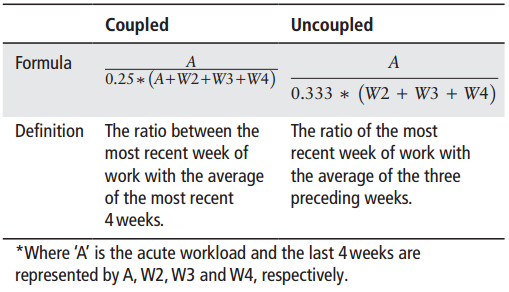

```{r setup, include=FALSE}
library(data.table)
library(ggplot2)
library(knitr)
library(TTR)
library(zoo)
```

## Acute:Chronic Workload Ratios?


If you've been keeping up with the athlete workload monitoring world, you've probably heard of the concept of acute:chronic workload ratios (ACWR). In case you haven't, the concept is relatively simple: how does the recently accumulated training load for an athlete (typically the last 3 - 7 days) compare to their chronic accumulation of training load (previous 3 - 6 weeks of training)? We can create a rolling average of the athlete's acute and chronic workload values and then divide the acute value by the chronic value to calculate an ACWR. These workloads can come from both external (balls pitched, distance travelled, etc.) and internal (session RPE, heart rate TRIMP, etc.) measures of training load [@Ehrmann_2016; @Hulin_2013; @Hulin_2015].

ACWR values provide a very intuitive snapshot of the training stress being experienced by the athlete and can be used to describe the "preparedness" of the athlete--that is, the relationship between their "fitness" and accumulated fatigue (see [@DeWeese_2015]). Normal training produces both adaptations in the athlete's fitness qualities and accumulated fatigue. Unfortunately, fatigue tends to mask complete expression of fitness qualities, so we want to avoid states of high fatigue when the athletes need to produce. Similarly, high levels of fatigue increase injury risk (although recent research [@Malone_2018] has highlighted that the relationship is a bit more complicated than that), so we need to be cognizant of our athletes' fatigue states during the planning and programming process.

Like I said, we can use an athlete's ACWR value to approximate their preparedness, with their acute workload representing "fatigue" and their chronic workload representing "fitness." An ACWR ~ 1 represents training at a "normal" level, whereas values > 1 and < 1 represent supranormal and below-normal training, respectively. It isn't necessarily wrong for the athlete's ACWR value to move into either range; things only become problematic when the athlete is over-fatigued (extremely high ACWR or extended periods > 1) or under-prepared for the rigors of competition (extended periods of detraining / ACWR values < 1). Typically, the "sweet spot" for ACWR is somewhere between 0.8 to 1.5 (the red lines in the plots below). Feel free to check out [@Gabbett_2016] for a much deeper conversation on this topic.



Plotting an athlete's ACWR alongside their daily and weekly training loads can give us an at-a-glance idea of whether our training loads have been appropriate. In the moment, we can use this data along with other monitoring data (e.g. jumps, questionnaires) to modify an athlete's training. Retrospectively, we can leverage ACWRs and other monitoring data to understand what went wrong (no program is ever perfect) and how we can improve our training program in subsequent seasons. For instance, in the image above it should be pretty clear this athlete's load profile is the opposite of what we want--a dense pre-season gives way to drastically reduced training loads during non-conference play that result in de-training. As he enters conference play, several double headers and a dense practice schedule (along with some punishment sessions for poor performance...and appearing tired `r emo::ji('thinking')`) lead to a spike in his ACWR followed by an extended period > 1. His load is reduced in an attempt to manage his fatigue from the punishment...week, but he's hit with another large spike in training (another punishment session) and a heavy week of training leading into the conference tournament. The team lost in the first round.

It probably wouldn't surprise you to know that this athlete's jumps fell during pre-season, rose during non-conference play, then *plummeted* during conference play and prior to the conference tournament. His mood questionnaire followed a similar pattern. I wasn't working with this team at the time, so the best I can do is provide feedback during the planning phase for the next season. More on what that feedback might look like in another blog post. Today, we're going to stay focused on ACWRs.

## An Extremely Hot Topic

While the use of ACWR values in athlete monitoring has become very popular in recent years, some recent papers have highlighted the shortcomings of the original ACWR calculation. First, fitness/fatigue degradation aren't linear--they instead decline in a nonlinear fashion, with fatigue decaying at a faster rate than fitness [@DeWeese_2015; @Murray_2016]. Further, the original ACWR calculation assigned the same relative weight to all training load values in both the acute and chronic rolling windows (that is, the load experienced yesterday carries the same weight as a training session from four weeks ago), when it stands to reason that more recently accumulated training will have a greater impact on an athlete's fitness and fatigue. Enter exponentially-weighted moving averages (EWMA), where a decay function is applied to give greater weight to recently-completed training. At least one paper [@Murray_2016] has shown greater sensitivity for EWMA to detect elevated injury risk when compared to the traditional moving average approach.

A second hot topic as of late is "mathematical coupling" of the acute and chronic workload values. In case you're scratching your head like I was the first time I saw the term "mathematical coupling" (I haven't had a math class in 11 years...and we won't get started on my quantitative reasoning score on the GRE), [Wikipedia](https://en.wikipedia.org/wiki/Coupling_(probability)){target="_blank"} has a pretty good explanation of the concept. Basically, by including the acute workload window (the previous 3 - 7 days) in the chronic workload window (the last 21 - 28 days), we create a spurious correlation between the two values that mis-represents the athlete's "true" ACWR [@Lolli_2017]. For ACWR < 1, coupled ACWR values are greater than their uncoupled counterparts. The ratios are the same at a value of 1, but uncoupled values become greater than coupled values when discussing ACWR > 1. Windt and Gabbett [-@Windt_2018] argue that while coupling or uncoupling the acute and chronic windows will lead to different interpretations of the ACWR,



the fundamental idea is the same: we should avoid large increases in workload, especially in athletes with relatively low chronic training (think returning to play from injury or pre-season camps in collegiate sports). And really, that's the crux of it all: avoid extremely large changes in training load because you will either overfatigue or underprepare your athlete and increase their risk of injury while decreasing their preparedness. And instead of just focusing on ACWR, we need to consider absolute and relative changes in workload in conjunction with measures of the athletes' training tolerance (mood-state questionnaires, HRV, resting heart rate, jump testing, etc.). This holistic approach to athlete monitoring will provide us far more context and actionable data than getting caught up on a single metric (the good ole "forest for the trees" approach).

## Calculating ACWR in R

With the history out of the way, let's get to the meat and potatoes of what I want to discuss: using R to calculate ACWR.

If you aren't familiar with R, you should be. R is a programming language that has been primarily used by statisticians to perform a wide variety of analytical techniques. The power of R comes from its high extensibility via packages--code libraries built to solve a variety of problems. Packages range from data manipulation packages (dplyr, data.table) to plotting (ggplot2, plotly) to dashboard creation (shiny, shinydashboard, flexdashboard) to...well, you get the idea. Basically, if you can dream up an idea, there's probably an R package for it. And in the off chance it doesn't exist in R but exists in Python (some of the high-level machine learning stuff), there's even a package to call Python code in R! Really, R is a jack-of-all-trades, master-of-most language.

This means problems that are extremely difficult to solve in Excel can often be conquered through loading a package and calling a single-line function in R. As an example, below is the array formula required to calculate a coupled chronic EWMA in Excel. You *might* need a magnifying glass.


See [Adam Sullivan's site](https://progressiveathleticperformance.com/free-downloads/){target="_blank"} for the spreadsheet I pulled this formula from.

Contrast that monster with what you would call in R:
```
library(TTR)
EMA(training_load, n = 1, ratio = 2/(1+28))
```

What I did in the above code block is call the ```TTR``` package (a package built for financial analyses) and then call the exponential moving average function (EMA). ```EMA``` requires three pieces of information: the data we're applying the function to, the size of the window to apply the decay ratio to, and the decay ratio. These correspond to column "E", the formula in column "G", and cell R9 in Adam's spreadsheet I linked above.

Granted, things get a bit more complicated when dealing with multiple athletes, but I think you'll agree with me that the R code is still substantially easier to follow than the Excel formula. In this next example, I'm using the package ```data.table``` in addition to the ```TTR``` and ```zoo``` packages to calculate both a traditional ACWR (via simple moving averages) and an exponentially-weighted ACWR. Check back soon because I'll have a video up that discusses the ins and outs of how to use ```data.table```.

### The Data

First, the [data](tl-data.csv):
```{r, echo=FALSE}
tl.data <- read.csv('tl-data.csv')

tl.data <- data.table(tl.data)

tl.data$training.date <- as.Date(tl.data$training.date)

knitr::kable(tl.data[1:10,])

ggplot(tl.data, aes(x= as.Date(training.date), y = tl, group = 1)) + geom_col() + facet_wrap(~athlete) + labs(title = 'Team Training Load', x = 'Training Date', y = 'Training Load') + theme_bw()
```

## More Than One Way to Skin a Cat

My data are stored in a data frame called tl.data. These are real values, but I've changed the names and dates to anonymize things. Anyway, the data frame has four columns: season, training.date, athlete, and tl. We aren't concerned with the season column today, but will revisit it once we dive down the rabbit hole of subsetting data. For now, let's start by calculating a 7:28 ACWR the "traditional" way--that is, coupled simple moving averages. Unfortunately, ```TTR::SMA``` doesn't implement the "partial" argument, so we have to turn to ```zoo::rollapplyr``` instead. With ```SMA```, you have to wait for both rolling windows to accumulate before an ACWR is calculated:

```{r, echo=FALSE}
tl.no.partial <- tl.data[athlete == 'Urja Chaudhry']

tl.no.partial[, ':=' (acute = SMA(tl, n = 7), chronic = SMA(tl, n = 28))]

tl.no.partial[, SMA.ACWR := acute/chronic]

knitr::kable(tl.no.partial[1:10,])
```

With ```rollapplyr```, on the other hand, the function will average the available data until it reaches the specified window size:

```{r, echo=FALSE}
tl.partial <- tl.data[athlete == 'Urja Chaudhry']

tl.partial[, ':=' (acute = rollapplyr(tl, 7, mean, partial = T), chronic = rollapplyr(tl, 28, mean, partial = T))]

tl.partial[, SMA.ACWR := acute/chronic]

knitr::kable(tl.partial[1:10,])
```

Now, if you want to wait for the windows to accumulate before returning an ACWR value, disregard what I just said about ```rollapplyr``` and use ```SMA``` instead. I'm honestly not sure what the "appropriate" method is in this case, but seeing as how ```SMA``` would spend ~ 1/3 of the season accumulating before returning an ACWR (college sports, man), I prefer ```rollapplyr``` in this case. This does leave us with the question of how to account for the athletes' training states coming into the season, but I'll leave that for another post.

Anyway, here's how I calculated the ACWR values above with ```rollapplyr```. You'll notice I'm able to apply these functions to each individual athlete thanks to the ```data.table``` package. I'll have a video on how that works soon.

**2018-06-12 edit:** I realized I left out a very important piece of information! If you're looking to copy these functions in the provided dataset or your own data, you'll need to enable data.table's functionality on the data prior to using the functions below. That's accomplished by calling:

```{r, eval=FALSE}
tl.data <- data.table(tl.data)
```

Sorry for any confusion!

```{r, echo=TRUE}
#Packages needed
library(data.table)
library(ggplot2)
library(zoo)

#Calculate each variable
tl.data[, sma.acute := rollapplyr(tl, 7, mean, partial = TRUE), by = .(athlete)]
tl.data[, sma.chronic := rollapplyr(tl, 28, mean, partial = TRUE), by = .(athlete)]
tl.data[, sma.ACWR := sma.acute/sma.chronic]

#Plot the data
ggplot(tl.data, aes(x = training.date)) + geom_col(aes(y = tl)) + 
  geom_line(aes(y = sma.ACWR * 1000)) + 
  scale_y_continuous(sec.axis = sec_axis(~./1000, name = 'SMA ACWR')) + 
  theme_bw() + facet_wrap(~athlete) + 
  labs(title = 'TL with SMA ACWR', x = 'Training Date', y = 'TL')
```

Unfortunately, calling ```rollapplyr``` is a bit of a handful compared to ```SMA```, but whatever. As you can see, we now have individual ACWRs using the "traditional" calculation method. How about using exponentially-weighted moving averages? Thankfully, this is a lot easier since we can use ```EMA```:

```{r, echo=TRUE}
#Packages needed
library(data.table)
library(ggplot2)
library(TTR)

#Calculate each variable
tl.data[, ema.acute := EMA(tl, n = 1, ratio = 2/(1+7)), by = .(athlete)]
tl.data[, ema.chronic := EMA(tl, n = 1, ratio = 2/(1+28)), by = .(athlete)]
tl.data[, ema.ACWR := ema.acute/ema.chronic]

#Plot the data
ggplot(tl.data, aes(x = training.date)) + geom_col(aes(y = tl)) + 
  geom_line(aes(y = ema.ACWR * 1000)) + 
  scale_y_continuous(sec.axis = sec_axis(~./1000, name = 'EMA ACWR')) + 
  theme_bw() + facet_wrap(~athlete) + 
  labs(title = 'TL with EMA ACWR', x = 'Training Date', y = 'TL')
```

Alternatively, if you want the EMA to accumulate before returning values, you would call:
```
tl.data[, ema.acute := EMA(tl, n = 7, ratio = 2/(1+7)), by = .(athlete)]
tl.data[, ema.chronic := EMA(tl, n = 28, ratio = 2/(1+28)), by = .(athlete)]
tl.data[, ema.ACWR := ema.acute/ema.chronic]
```

I should point out these two methods **_return different values_**, unlike ```SMA``` and ```rollapplyr```. This is because of the decay ratio in ```EMA```. So don't use different window sizes (n = 1 vs. n = 7 or n = 28) interchangably. And be sure to report how you're calculating your windows!

Let's compare our ACWR values for a single athlete. I've included ACWRs for the traditional method and both methods of EMA discussed above:

```{r, echo=TRUE, message=FALSE, warning=FALSE, dpi=300}
#Alternate EMA calculation
tl.data[, ema.acute.alt := EMA(tl, n = 7, ratio = 2/(1+7)), by = .(athlete)]
tl.data[, ema.chronic.alt := EMA(tl, n = 28, ratio = 2/(1+28)), by = .(athlete)]
tl.data[, ema.ACWR.alt := ema.acute.alt/ema.chronic.alt]

#Shift the ACWR values down one day to accurately reflect the effect of the previous day's training
tl.data[, c('sma.lagged','ema.lagged', 'ema.alt.lagged') := 
          shift(.SD, n = 1, type = 'lag', fill = NA), 
        .SDcols = c('sma.ACWR','ema.ACWR', 'ema.ACWR.alt'), by = .(athlete)]

#Plot the results
ggplot(tl.data[athlete == 'Urja Chaudhry'], aes(x = as.Date(training.date), group = 1)) + 
  geom_col(aes(y = tl)) + geom_line(aes(y = sma.lagged * 1000, colour = 'SMA')) + 
  geom_line(aes(y = ema.lagged * 1000, colour = 'EMA')) + 
  geom_line(aes(y = ema.alt.lagged * 1000, colour = 'EMA alt')) +
  scale_y_continuous(sec.axis = sec_axis(~./1000, name = 'ACWR')) + 
  labs(title = 'ACWR Comparison', x = 'Training Date', y = 'TL', colour = 'Method') + 
  theme_bw() + theme(legend.position = 'bottom')
```

Hopefully you notice there are some pretty stark diffferences between the SMA and EMA methods, with the differences in the two EMA approaches mostly disappearing by day 45. This echoes what Windt and Gabbett [-@Windt_2018] say at the end of their editorial: explicity detail how you're calculating your ACWRs!

## Coupled vs. Uncoupled

If you've read Windt and Gabbett's editorial [-@Windt_2018], they provide an equation to convert coupled ACWRs to uncoupled ACWRs:

$Uncoupled ACWR = \frac{3 * Coupled ACWR}{4 - Coupled ACWR}$

This post is pretty long in the tooth at this point, so I'm only going to apply this function to my original EMA calculation (n = 1). The same functions will apply for the other ACWR methods.

```{r, echo=TRUE, warning=FALSE, dpi=300}
#Uncoupled EMA ACWR calculation
tl.data[, uncoupled.ema := (3 * ema.lagged)/(4 - ema.lagged)]

#Plot the results
ggplot(tl.data[athlete == 'Urja Chaudhry'], aes(x = as.Date(training.date), group = 1)) +
  geom_col(aes(y = tl)) + geom_line(aes(y = ema.lagged * 1000, colour = 'Coupled')) +
  geom_line(aes(y = uncoupled.ema * 1000, colour = 'Uncoupled')) +
  scale_y_continuous(sec.axis = sec_axis(~./1000, name = 'ACWR')) +
  labs(title = 'Coupled vs. Uncoupled', x = 'Training Date', y = 'TL', colour = 'Method') +
  theme_bw() + theme(legend.position = 'bottom')
```

And that's it. There are some definite differences in the two methods, so again, be consistent in how you choose to perform your analysis.

## Wrapping Up

ggplot code notwithstanding (that stuff gets to be a mess after a while), hopefully this post highlighted the fact that a few lines of R code can accomplish the same thing as lines and lines of Excel array formulas. The syntax might look a little scary at first, but once you get the hang of it, you can pound out extremely complex analysis code in a few minutes. From there, you can create a report or a dashboard that will allow you to drill down into your data. 

Something also worth mentioning is the time required to update an Excel spreadsheet vs. using a script in R. Excel does not play nice with large data sets that contain multiple sets of array formulas. As you add more data and the files get larger, they take longer to open, adding new training data causes the workbook to hang, and you're *never quite sure* if saving the workbook is going to save your additions or cause Excel to crash. Contrast that with R: I have eight years of men's soccer RPE data. There are ~ 35,000 records, 89 athletes, and 16 seasons (fall/spring). Running the above EMA calculations (with n = 1) on the data took ~ 0.2 seconds. I'm pretty sure Excel would literally cause my computer to catch on fire if I tried that in a workbook. So while there's some learning required on the front end, the benefits far outweigh the costs.

If you do want to stay in the Microsoft ecosystem, though, you can have your cake and eat it too if you use Power BI, Microsoft's business insights software. Think of it as a suped up version of Excel that can actually handle large amounts of data without exploding. Better yet, it has R code support, so you can actually import your data through Power BI and execute code that returns your data with all the necessary calculations. I've successfully used that approach to create dashboards for a few coaches over the last few years. I'll (eventually) have a video up walking you through that process.


As for which ACWR method is "correct," ¯\\\_(ツ)\_/¯. I tend to agree with Windt and Gabbett [-@Windt_2018] that we shouldn't get lost in the minutiae of simple vs. exponential vs. coupled vs. uncoupled vs. whatever else this field comes up with. At the end of the day, we need to prescribe training loads in a logical fashion so we don't completely break our athletes: High chronic workloads need to be built slowly over time to prepare our athletes for the worst-case scenario (for us a few years ago, that was three double overtime games in 12 days against teams who all finished in the top 15), and we need to monitor how our athletes are tolerating training through a combination of physical and psychological assessments. Let's worry about the small problems once we get the basics down, yeah?

## Code Recap

To recap the code I used in this post:

```{r, eval=FALSE}
# Required packages
library(data.table)
library(ggplot2)
library(TTR)
library(zoo)

# Enabling data.table functionality
tl.data <- data.table(tl.data)

# Coupled ACWR via simple moving averages
tl.data[, sma.acute := rollapplyr(tl, 7, mean, partial = TRUE), by = .(athlete)]
tl.data[, sma.chronic := rollapplyr(tl, 28, mean, partial = TRUE), by = .(athlete)]
tl.data[, sma.ACWR := sma.acute/sma.chronic]

# Alternatively
tl.data[, sma.acute := SMA(tl, 7), by = .(athlete)]
tl.data[, sma.chronic := SMA(tl, 28), by = .(athlete)]
tl.data[, sma.ACWR := sma.acute/sma.chronic]

# Coupled ACWR via exponentially-weighted moving averages
tl.data[, ema.acute := EMA(tl, n = 1, ratio = 2/(1+7)), by = .(athlete)]
tl.data[, ema.chronic := EMA(tl, n = 1, ratio = 2/(1+28)), by = .(athlete)]
tl.data[, ema.ACWR := ema.acute/ema.chronic]

# Alternatively,
tl.data[, ema.acute := EMA(tl, n = 7, ratio = 2/(1+7)), by = .(athlete)]
tl.data[, ema.chronic := EMA(tl, n = 28, ratio = 2/(1+28)), by = .(athlete)]
tl.data[, ema.ACWR := ema.acute/ema.chronic]

# Uncoupling the ACWR
tl.data[, uncoupled.ema := (3 * ema.lagged)/(4 - ema.lagged)]
```

Let me know if you have any questions! Shoot me an email: [samsperformancetraining@gmail.com](mailto:samsperformancetraining@gmail.com)

## References